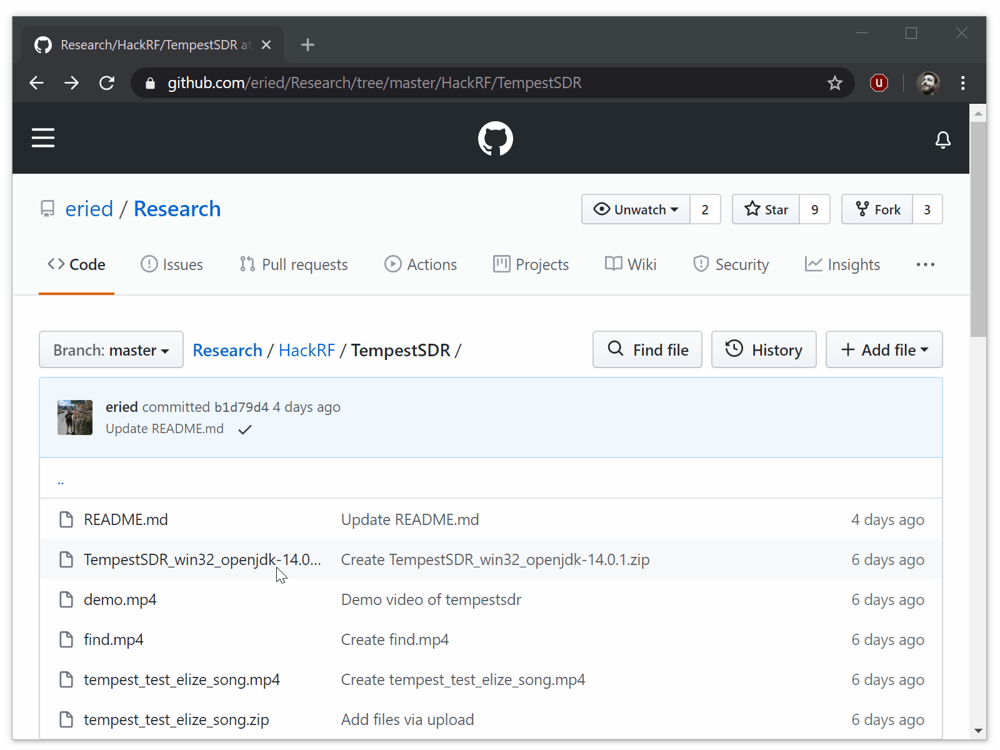

# TempestSDR

`TempestSDR_win32_openjdk-14.0.1.zip` contains a self-executable version of https://github.com/martinmarinov/TempestSDR for Windows. **No other dependencies are needed.**

> **Note:** Some antivirus can report a [false positive](https://www.virustotal.com/gui/file/d983534737266fb46c84bb3a9e61e99b7122beacd0677e7edf4e74e0552165bf/detection) as seen in the link. However, this is due the usage of [launch4j](http://launch4j.sourceforge.net/) for wrapping the jar and WinRAR.SFX module for launching everything.

## HackRF as source in TempestSDR:
1. Set the HackRF in HackRF mode (if the PortaPack is connected) and connect it via USB. The device must be recognized properly (i.e. for doing firmware upgrades or using it in SDRSharp), if you are having problems please follow: https://www.youtube.com/watch?v=_zx4ZvurgOs
2. Open TempestSDR. The provided package does not has any requirement and includes everything. It uses temporal files for OpenJDK, and other required files.
3. Select `File / Load ExtIO source` and select the adequate options in the modal dialog
4. Press Start in TempestSDR to begin

## Modding the self-executable with other EXTIO DLLs

Check this video https://www.youtube.com/watch?v=QjqpKtGNbQo

## Basic instructions

1. Get near the target screen, place the HackRF next to it
2. Play `tempest_test_elize_song.mp4` or the program inside `tempest_test_elize_song.zip` to generate a pattern you can detect in the target screen
3. Work in SDRSharp or a similar software solution to find the frequency of the residual RF that the screen generates. As a starting seed, try from 100 Mhz to 500 Mhz listening in AM mode. It should look/sound like [in this video](find.mp4).
4. Open TempestSDR following the upper instructions and use the frequency you found in the previous step
5. Play with the options until you get a working image. It should look like [in this video](demo.mp4).
