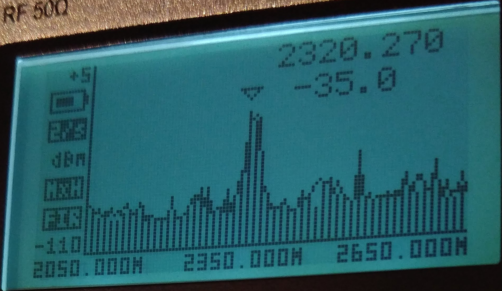
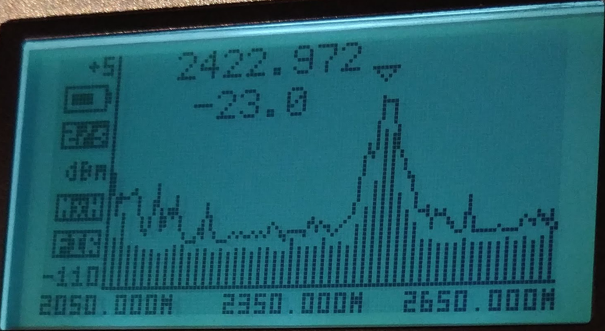
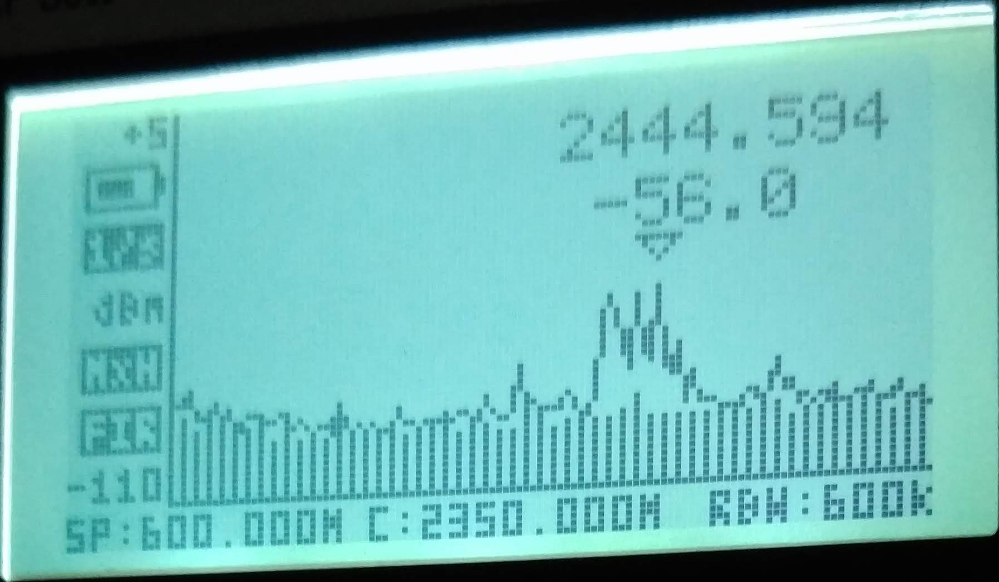
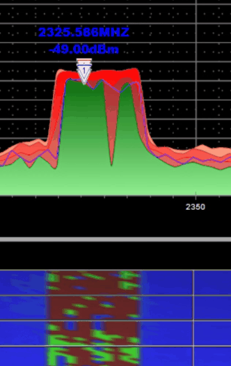

# Special modes test

The test procedure was:
1) Power everything down
2) Modify parameters
3) Turn drone on, then RC, then app
4) Wait 
5) Capture analyzer screen

## Results

Using NLD patched app 4.1.22 for the tests

 | Test | Distance | BoostMode | ForceFCC | SpecialFrequencyMode | Result | Notes | 
 | --- | --- | --- | --- | --- | --- | --- | 
 | 1 | 1 m | true | false | 0 |  | | 
 | 2 | 1 m | true | false | 1 |  | | 
 | 3 | 1 m | true | false | 1 |  | | 
 | 4 | 1 m | true | false | 1 |  | Activity over 2.4 Ghz | 
 | 5 | 1 m | true | false | 2 |  | | 
 | 6 | 1 m | true | false | 2 |  | Activity over 2.4 Ghz| 
 | 7 | 1 m | true | true | 0 |  | | 
 | 8 | 1 m | true | false | 0 |  | | 
 | 9 | 50 m | false | false | 0 |  | 3 rooms away| 
 | 10 | 50 m | false | true | 0 |  | 3 rooms away| 
 | 11 | 50 m | true | true | 0 |  | 3 rooms away| 
 
 
 ## Background noise
 
 This is after one minute with drone and RC off
 
 | Test | Distance | BoostMode | ForceFCC | SpecialFrequencyMode | Result | Notes | 
 | --- | --- | --- | --- | --- | --- | --- | 
 | 12 | - | - | - | - |  | | 
 
 # Conclusions and comments
 BoostMode, ForceFCC and SpecialFrequencyMode only affect the video transmission. This is the switch between BoostMode false and true in FCC mode:
 
 
 
 Considering that the noise scale is logaritmic the improvements are:
  
  | From | To | Improvement |
  | --- | --- | --- |
  | CE | FCC | 1485% |
  | FCC | Boost+FCC | 401% |
  
  The communication mode is set by DJI GO4 while starting up. There is no need to press "Go Fly".

