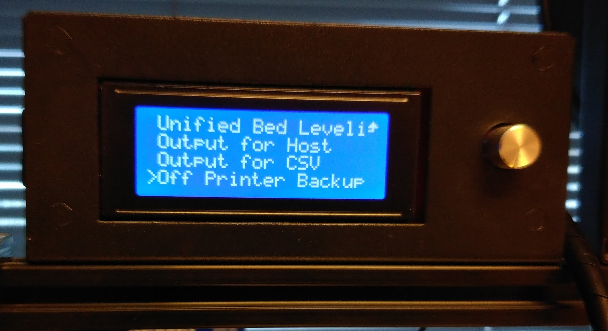
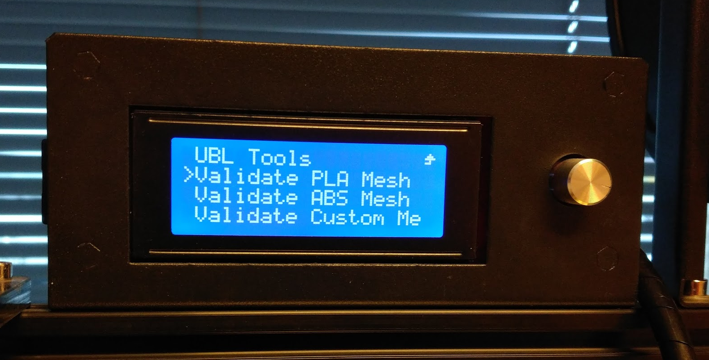
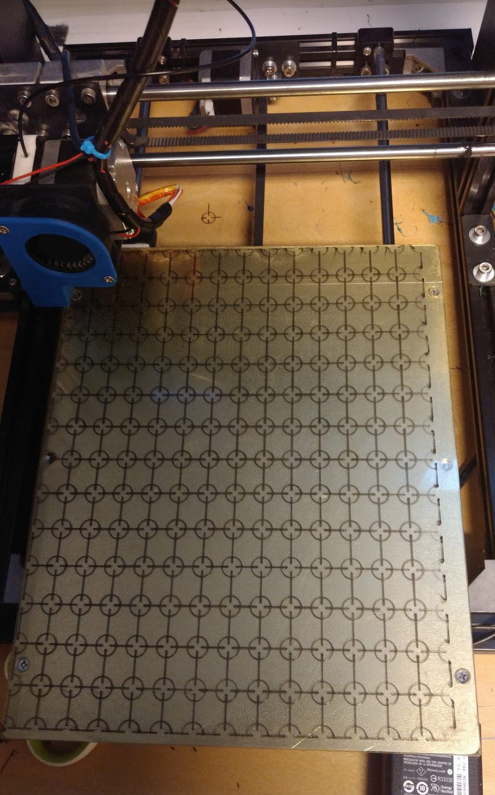
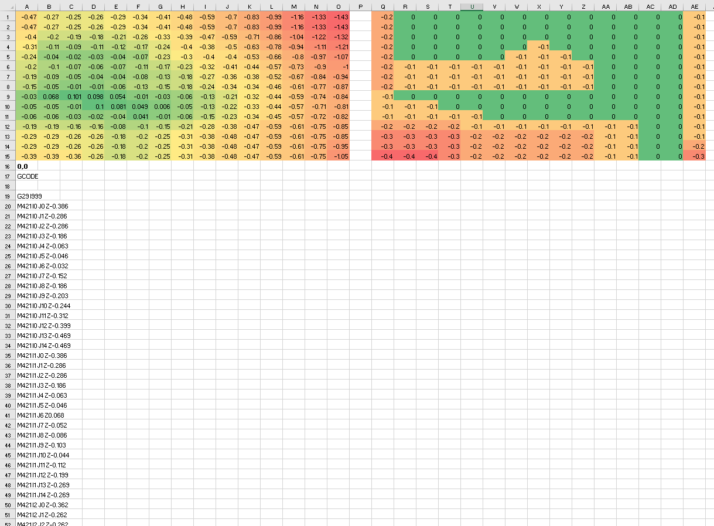
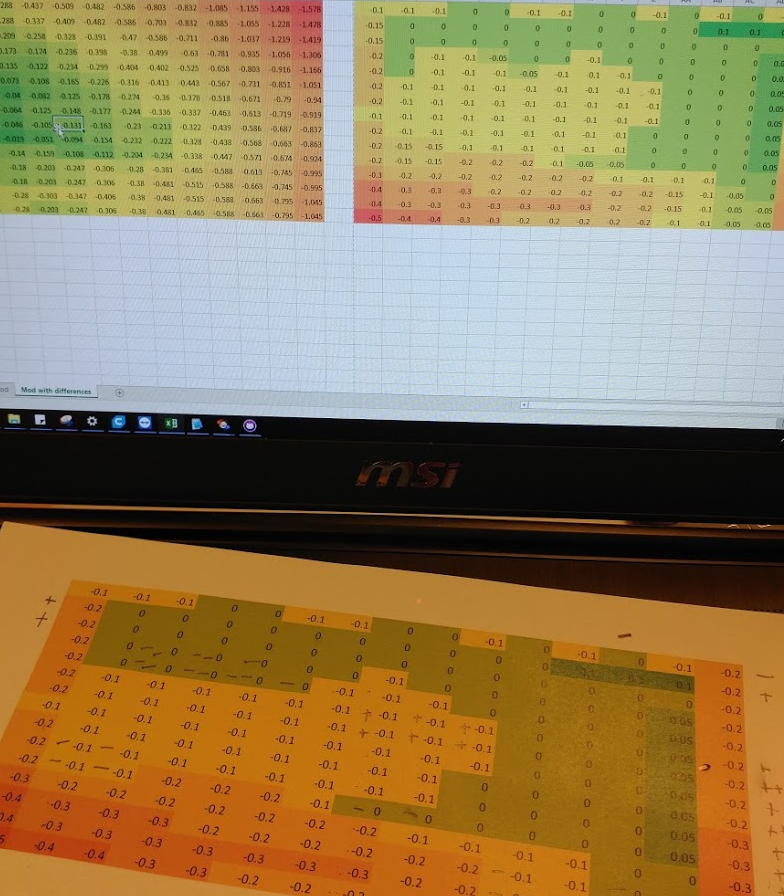
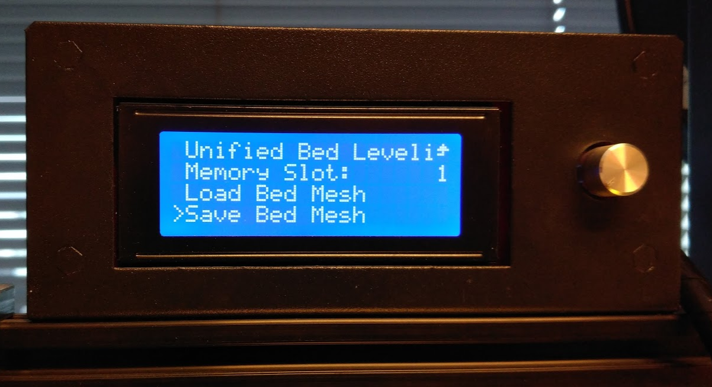

# Step by step UBL
_Tested in Marlin-1.1.9_

## _Configuration.h_
1) Make sure that `X_PROBE_OFFSET_FROM_EXTRUDER, ...` are properly configured. Also `MIN_PROBE_EDGE` to prevent the sensor going outside the bed. I prefer `MULTIPLE_PROBING` set to 2. 
2) Enable `AUTO_BED_LEVELING_UBL` by uncommenting the respective line
3) To increase the precision of the measurements I like to set `GRID_MAX_POINTS_X` as 15
4) For validation with `G26`, you need to enable `G26_MESH_VALIDATION`

Upload the new firmware. Leave the USB connected and connect to it using a serial terminal program like Putty.

## _In the printer_
5) Heat the bed and wait until it reaches your printing temperature
6) Run `Unified Bed Leveling / Step-By-Step UBL / Build Cold Mesh`
7) Run `Unified Bed Leveling / Output Mesh / Output for Host`

> ### Output for Host
> Sends the mesh in an human readable format via serial

> ### Output for CSV
> Sends the mesh in a csv format (you will need it later)

> ### Off Printer Backup
> Sends the GCODE necesary to recreate the mesh (not needed)

8) Run `Unified Bed Leveling / Step-By-Step UBL / Smart Fill-in` several times checking with `Output for Host` until all the values of the mesh are filled
9) Run `Unified Bed Leveling / Step-By-Step UBL / Validate Mesh` (select PLA or ABS in the submenu). Feed a filament that has a proper constrast with your bed color. Click the menu button in the printing to start the Validation

This is going to print a one layer test print for checking the distance.

## _In your PC_

10) Open _calibration.xlsx_ in Excel and fill it with your mesh values using the Output for CSV
11) The idea is to use the adjust matrix to tune the mesh using the printed validation mesh

You can use the validation mesh for doing pranks too: https://www.thingiverse.com/thing:3121156

>### Excel file details
>
>Paste your original mesh values in the first sheet `Reference`. If you want to create an alternative bed mesh from scratch, use the sheet `Alternative values` otherwise use `Reference plus correction`. The idea here is to set the differences in the grid in the top right side. 
>Use **positive values to raise the nozzle** (the print is too squished in that point) or **negative values if you want to lower the nozzle**.

12) Send the new mesh, copy the excel output to putty, and test what you received with `Output for Host` function (try in smaller pieces if it fails)
13) Repeat the procedure `Validate Mesh` and improve the mesh

>What I did is to print the table with the adjustments from `Reference plus correction` sheet (right side) and carefully follow the Validation print. In the first stages I just wrote + or - depending if I wanted +0.1 or -0.1 near the field
>
>
>In the later stages (after the second validation, I just adjusted the values by 0.05). After 3 loops, everything was acceptable enough

## _In the printer_
14) Save the mesh in a slot in the EEPROM

## _In your slicer_

_Start G-CODE_: Replace homing procedure (G28) with:

    G28 X0 Y0 ;move X/Y to min endstops
    G28 Z0 ;move Z to min endstops
    M117 Auto-level...
    G29 L1  ;load autolevel
    G29 A   ;enable UBL
    ;G29 J   ;tilt mesh

You can uncomment the tilt mesh line to auto-tilt the mesh to the bed. Use the same mesh slot in `G29 L1  ;load autolevel` (`L1` is slot 1)
